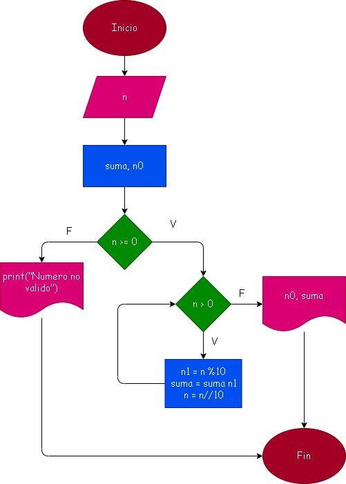

# Suma_de_digitos
Hacer el diagrama de glujo que lea el numero , entero y positivo, de cualquier numero de digitos , que calcule la suma de sus digitos y que la imprima con el numero leido.

# Analisis
Los numeros enteros potivos deben ser siempre mayor o igual a 0, sino es un numero negativo no valido, para sumar todos los digitos se utiliza el modulo % 10 para tomar el ultimo digito y luego sumarlo en una variable, para seguir sumando los siguientes digitos restantes se utiliza la valor digitado //10 para que tome los anteriores numeros en entero y siga sumando a una variable hasta llegar al digito 0 en un ciclo.

